# Architecture Diagram - 4 Website Variants

## High-Level Architecture

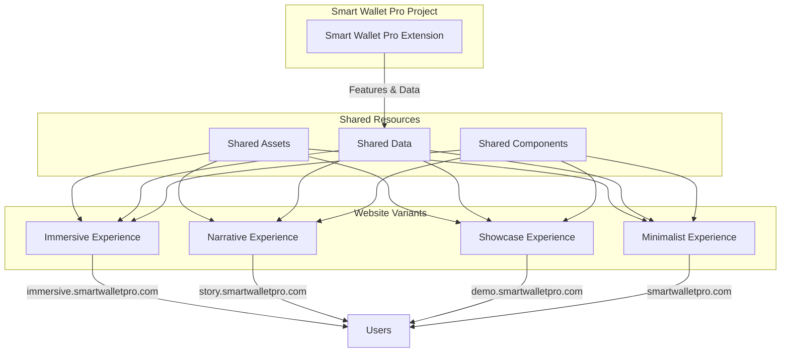

---

## Component Hierarchy

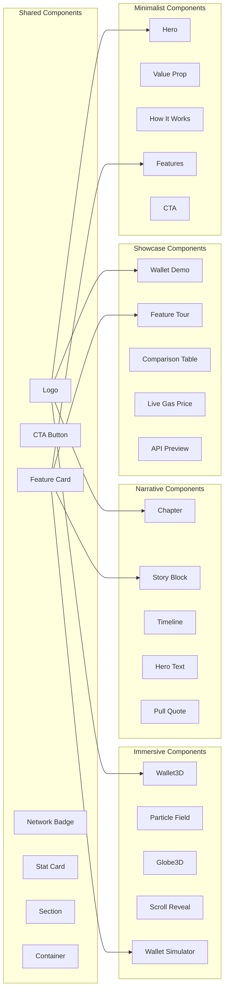

---

## Data Flow

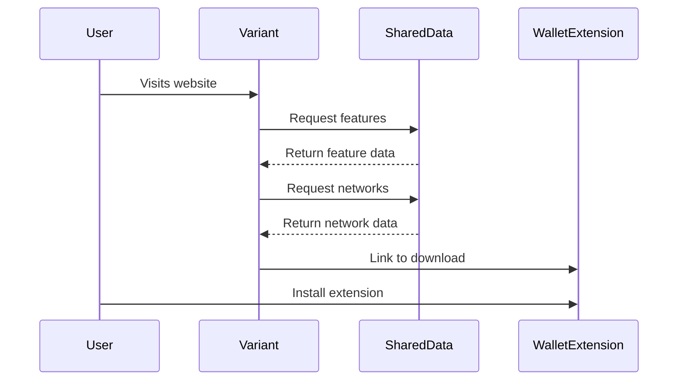

---

## Implementation Flow

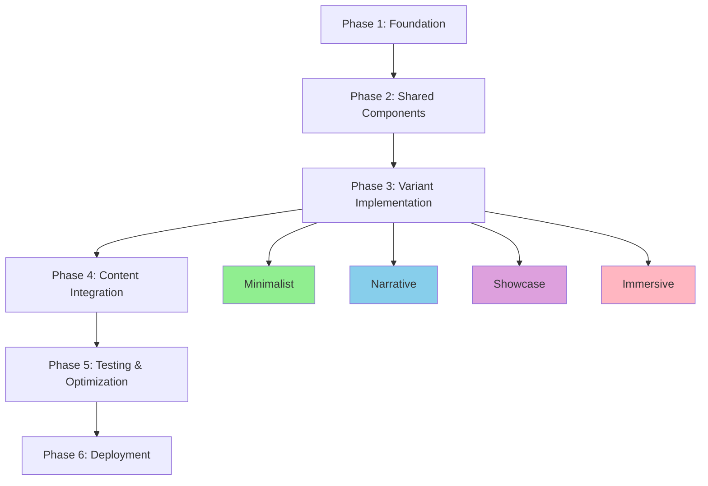

---

## Tech Stack Comparison

| Component | Immersive | Narrative | Showcase | Minimalist |
|-----------|-----------|-----------|-----------|------------|
| Framework | Next.js 15 | Next.js 15 | Next.js 15 | Next.js 15 |
| Styling | Tailwind + Framer | Tailwind + Custom | Tailwind + Radix | Tailwind |
| 3D | Three.js + R3F | - | - | - |
| Animations | GSAP + Framer | Framer | Framer | CSS only |
| Data Fetching | - | - | TanStack Query | - |
| Charts | Recharts | - | Recharts | - |
| MDX | - | MDX | - | - |
| Bundle Size | Large | Medium | Medium | Small |
| Load Time | Medium | Medium | Medium | Fast |
| Complexity | High | Medium | High | Low |

---

## User Journey by Variant

### Immersive
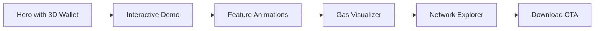

### Narrative
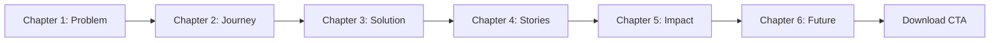

### Showcase
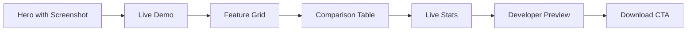

### Minimalist
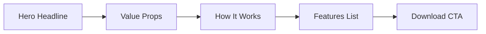

---

## Deployment Architecture

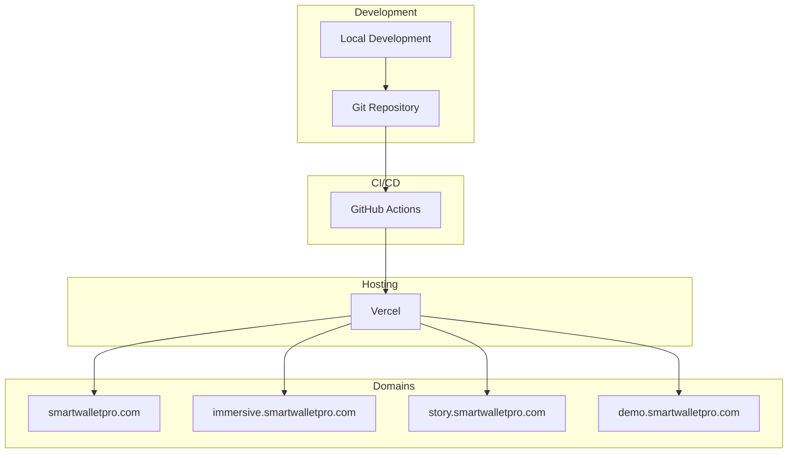

---

## Performance Targets

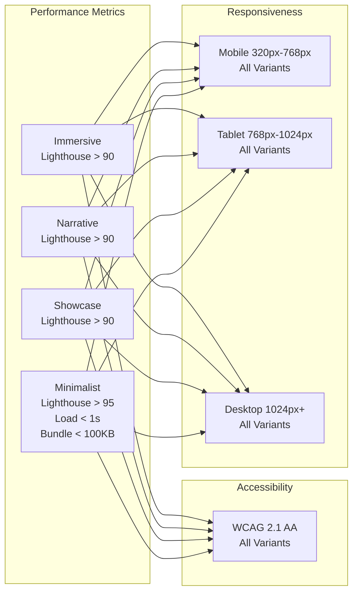

---

## Shared Data Structure

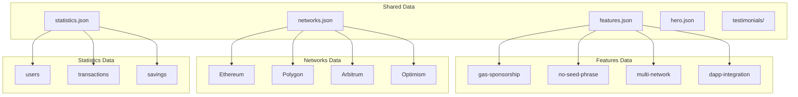

---

## Component Reusability Pattern

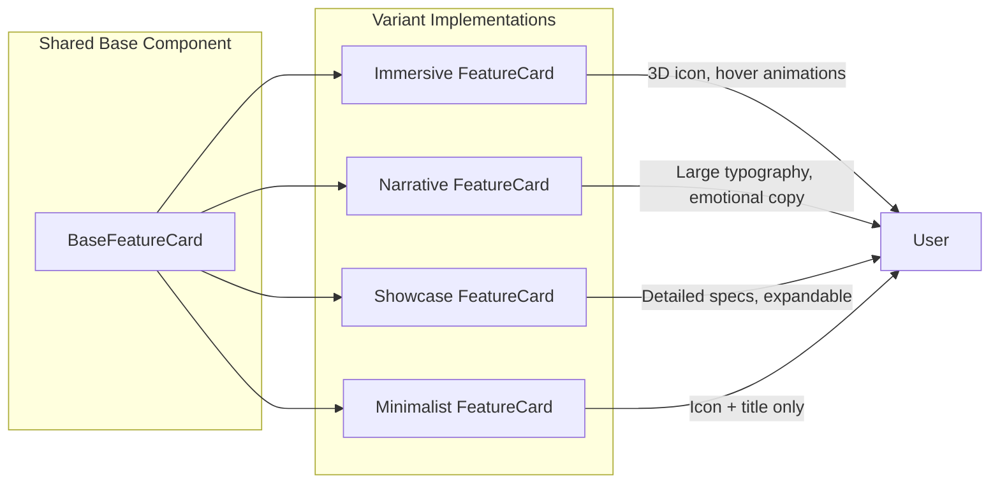

---

## File Structure Overview

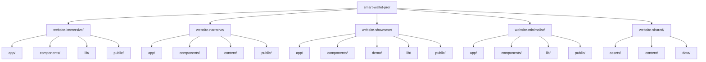

---

## Success Metrics Flow

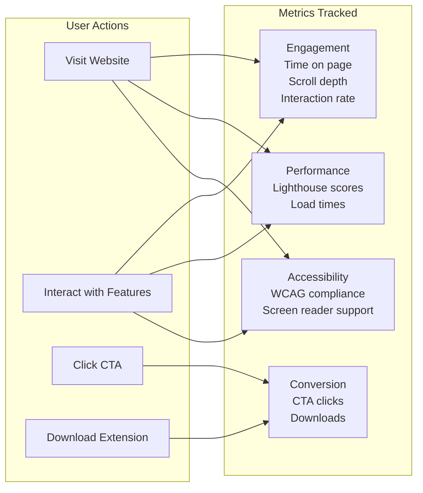

---

## Summary

This architecture diagram illustrates:

1. **High-level structure** of all 4 variants and their relationship to shared resources
2. **Component hierarchy** showing shared and variant-specific components
3. **Data flow** between variants, shared data, and the wallet extension
4. **Implementation flow** through all phases
5. **Tech stack comparison** across all variants
6. **User journeys** for each variant
7. **Deployment architecture** from development to production
8. **Performance targets** for all variants
9. **Shared data structure** and organization
10. **Component reusability pattern** for efficient development
11. **File structure overview** for each variant
12. **Success metrics flow** and tracking

All diagrams use Mermaid syntax and can be rendered in any Markdown viewer that supports Mermaid.
